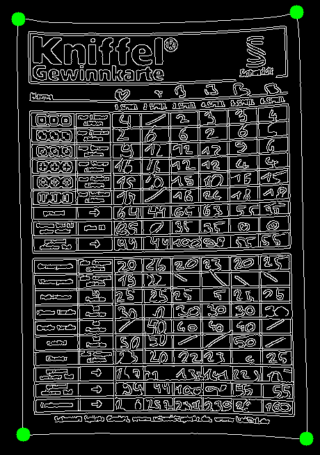
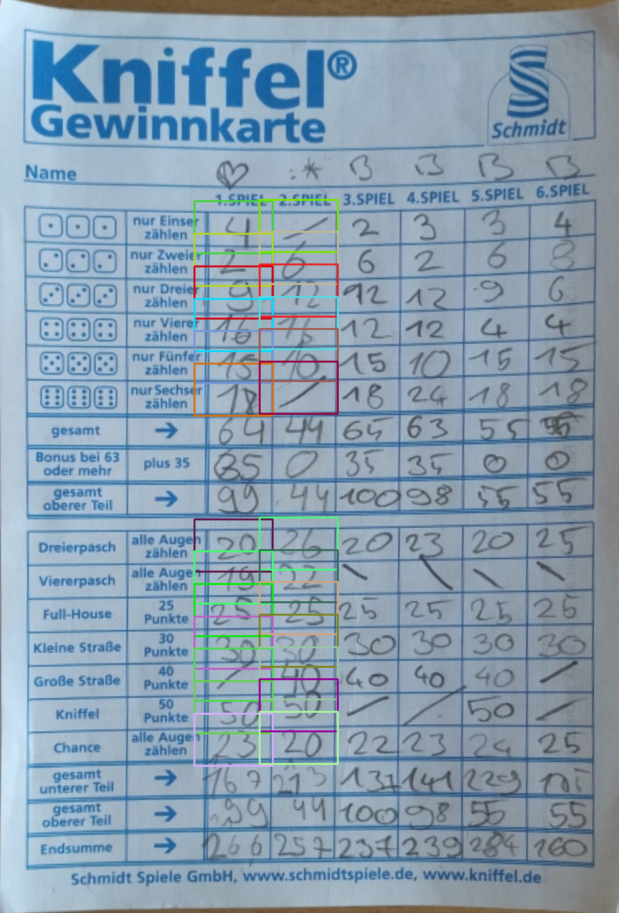
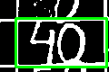
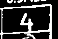
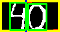
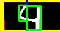
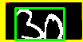

# KniffelCam

This is a JavaScript webapp that tries to read the digits from a handwritten Kniffel (Yahtzee) scorecard and helps calculate the results.

(Go ahead and test it here: [https://ctrly.de/kniffelcam.html](https://ctrly.de/kniffelcam.html) 😊)

The function can be separated into 5 sections:
 1. Detect the scorecard (using the OpenCV library)
 2. Approximate the location of each cell in the table
 3. Detect the cell borders
 4. Clean and separate the handwritten digits
 5. Infer the digit (using a convolutional neural network trained on the MNIST dataset)
 6. Show the results

### 1. Detect the scorecard (`detectCardCorners()`)
  

As soon as the camera is active, the app starts scanning the image for a large rectangle that might be the outline of the scorecard.
The camera image is turned to binary color and processed with OpenCV's `findContours()` function. The largest 4-corner countour is selected and overlayed on the camera image. When the user is satisfied with the found contour, the processing of the image can be started with the "Capture"-button

### 2. Approximate the location of each cell in the table (`extractCells()`)
  

The cell positions are approximated from hand measured values with plenty of padding to allow for inaccuracies in the printed card or the warped camera image. If cell detection fails, this step is repeated with different starting values for the approximate cell locations. This allows for even more inaccuracies (e.g. when the card has curled edges).

### 3. Detect the cell borders (`refineCell()`)
  

The actual cell boundaries are detected from the cropped image section of the approximate cell location. This is done simply by counting the number of white pixels in each row and column and checking against a threshold to define if it is a straight vertical or horizontal line.

Te cell borders often overlap with the handwritten digits and thus do not form a clear rectangular contour. Methods like OpenCV's `findContours()` are therefore not suitable. This method does however fail when the card is warped too much so that the borders are no longer recognized as straight lines (at some point maybe I'll change this so that it works not only for strictly horizontal/vertical lines but for any straight lines with reasonable angles):

  

### 4. Clean and separate the handwritten digits (`cleanCellEdges()`, `removeBorderArtifacts()`, `findDigitSplit()`)
  

The cell image is cropped to the coordinates of the cell borders. Any remaining pixels of the cell border are removed from the edges of the image. The image is then scanned left to right for gaps between larger contours which separate two digits (The neural network only understands single digits).
This can fail if a single digit has a gap in it's contour and is then split in half or if two digits are too close together and no separation is found (I'm pretty sure this could be solved with better tweaking of the threshold values):

  

### 5. Infer the digit (`prepareDigitImages()`, `preprocessForMNIST()`, `predictDigitMNIST()`)
The contours of each digit are placed in the middle of a black (28x28) rectangular background so that it resembles the MNIST training data as much as possible. The image is then fed to a pretrained 8 layer convolutional neural network (The model architecture and training process is simply copied from the [TensorFlow.js examples](https://github.com/tensorflow/tfjs-examples/tree/master/mnist))
The output of the model is not very accurate (at least on my handwriting) so a step of... let's call it [*predicitve processing*](https://en.wikipedia.org/wiki/Predictive_coding) is added, which tries to correct the inference output based on hardcoded assumptions:
 - If it's the first of two digits and the model predicts a 7 we assume that it's actually a 1
 - If the model outputs a 1 but it's not the "1"s field (the only field where a value of 1 is possible), then we assume it's a "/" (i.e. a value of 0)
 - If it's a field that has a predetermined value (e.g. 25 for Full-House) we always assume that it's this value (if we've not already determined that it must be a "/").

A function for OCR with Tesseract is currently disabled since I've found the results to be significantly worse and slower.

### 6. Show the results
The results table is constructed for the given number of players (i.e. the number of scanned columns on the score card). The results are updated with the output of each inferred digit. After the model inference step has finished, incorrect output can be manually corrected to recalculate the result.